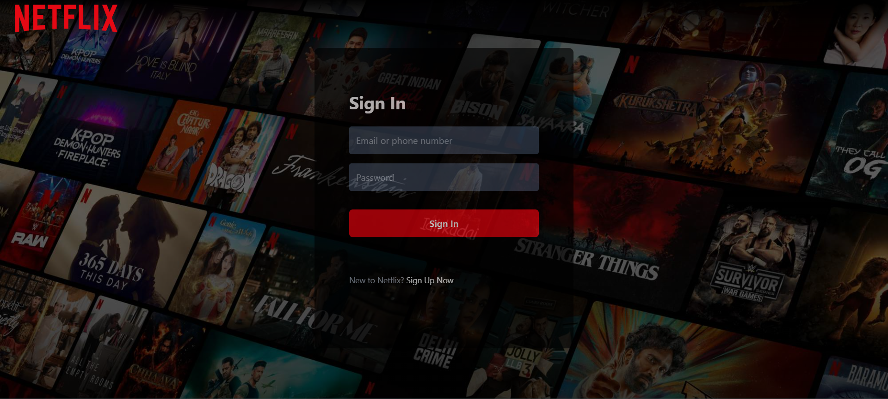
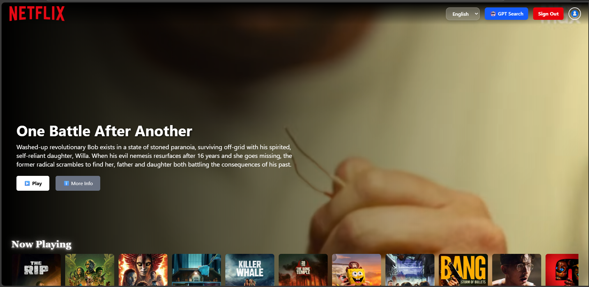
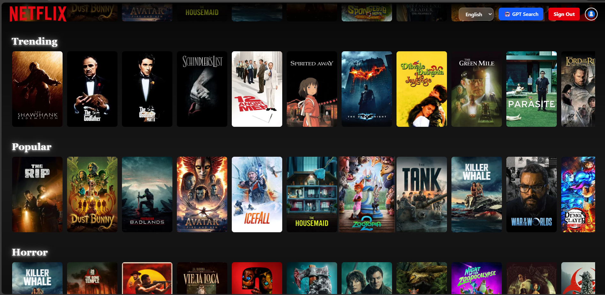
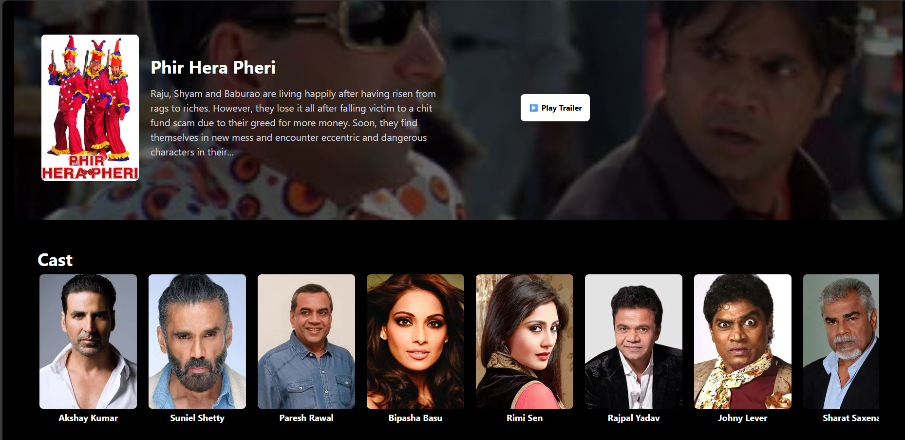
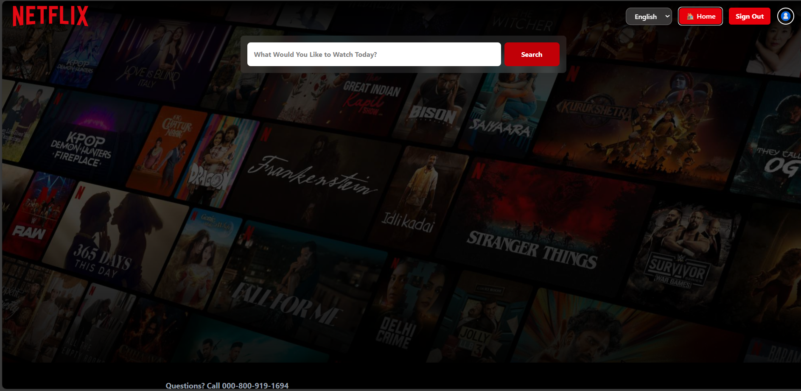
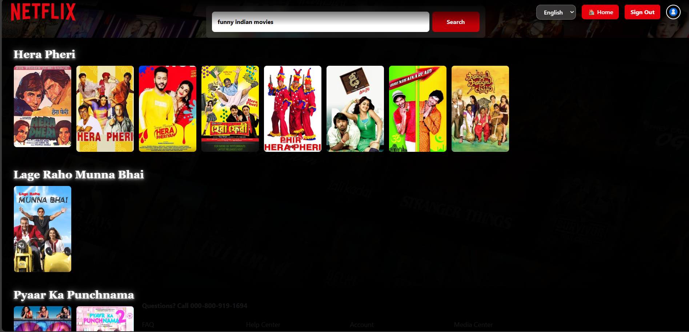

# 🎬 Stream-GPT – stream-gpt-Inspired Movie Platform

Stream-GPT is a **stream-gpt-inspired web application** built using **React**, **Redux Toolkit**, **Firebase**, **Tailwind CSS**, and **TMDB API**.  
It features **authentication, movie trailers, cast details, recommended movies, and GPT-powered search**.

---

## 🚀 Features Implemented

### 🔐 Authentication

- Email & Password Signup + Validations
- Email Verification Flow
- Verified-only Login Protection
- Persistent Auth State using Firebase Observer
- Modern non-blocking notifications via `react-hot-toast`

### 🎬 Movie & Trailer System

- Fetch movie details and trailers via TMDB API
- Play Trailer in full-screen modal with ESC close support
- Responsive YouTube iframe embed
- Stop trailer automatically on close
- Movie description truncation with "Read more / less"

### 🎭 Cast & Similar Movies

- Top 12 cast members with images & roles
- Scrollable "You’ll also like" section for similar movies

### 🤖 Stream-GPT Movie Recommendations (Upcoming)

- GPT-powered natural language recommendations
- Search by mood, genre, actor, or plot description
- Integration with TMDB for real movie data

### 🎨 UI / UX

- Tailwind CSS responsive design
- stream-gpt-style buttons, typography, and layout
- Dark-mode friendly hero sections
- Smooth transitions and hover effects

---

## 🏗️ Project Structure

src/
│── components/
│ ├── Login.jsx
│ ├── Header.jsx
│ ├── VideoTitle.jsx
│ ├── VideoBackground.jsx
│ └── MovieDetails.jsx
│
│── hooks/
│ └── useTrailerVideo.js
│
│── utils/
│ ├── firebase.js
│ ├── validate.js
│ ├── constants.js
│ ├── FirebaseErrors.js
│ └── movieSlice.js
│
│── store/
│ └── appStore.js
│
│── App.js
└── index.js

---

## 📸 Screenshots

Here’s a step-by-step walkthrough of the Stream-GPT app:

---

### 1️⃣ Login Page

Users can securely log in or sign up with Firebase Authentication.

---

### 2️⃣ Browser / Movie List Page

Browse trending, popular, and recommended movies with stream-gpt-style cards.

---

### 3️⃣ Movie Details & Trailer Modal

Click on a movie to see details, cast, similar movies, and play trailers.

---

### 4️⃣ GPT Search

Search movies using natural language with GPT integration.

---

### 5️⃣ GPT Movie Recommendations

View AI-powered recommendations based on your query.

## 🛠️ Tech Stack

- React 18
- Redux Toolkit
- Firebase Auth
- TMDB API
- Tailwind CSS
- React-hot-toast

---

## 🔮 Roadmap / Upcoming Features

- Full GPT-powered movie search
- Watchlist / My List functionality
- Continue Watching / Resume playback
- Accessibility & performance improvements
- Smooth animations and focus traps

---

## 💼 Why This Project Matters

- Demonstrates real-world **authentication flows**
- Scalable **Redux architecture**
- Clean **API integration and UI/UX**
- stream-gpt-style experience
- Strong talking points for **React & frontend interviews**
